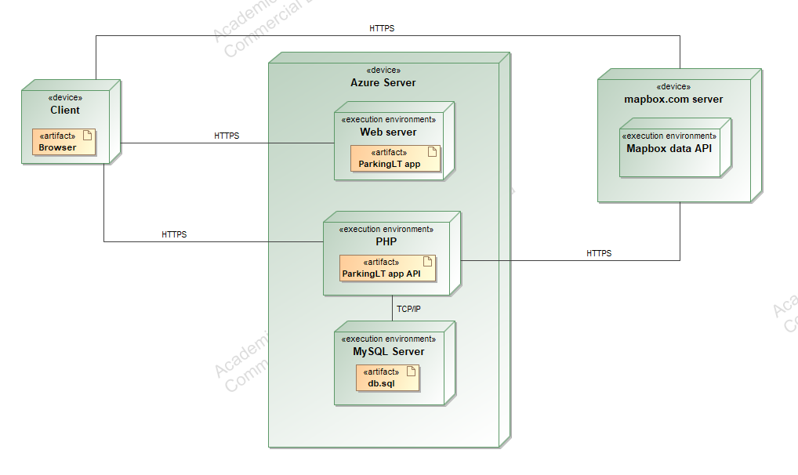

# Parkavimo sistema „ParkingLT“
## Uždavinio aprašymas
Projekto tikslas – palengvinti vairuotojams lengviau atrasti stovėjimo vietą tam tikroje miesto vietoje, taip sutrumpinant laiką ieškant laisvos vietos, kur gali palikti savo transporto priemonę.

Ši kuriama platforma ne tik padės taupyti vairuotojams laiką, bet ir padės sumažinti spūsčių susidarymo atvejus, ieškant laisvos stovėjimo vietos bei sumažins išmetamųjų teršalų kiekį.

Vairuotojas, norėdamas naudotis parkavimo sistema, nebūtinai turi prisiregistruoti prie sistemos. Neprisiregistravęs naudotojas galės matyti tuo momentu laisvas stovėjimo vietas, pamatyti kiek kainuoja tam tikroje zonoje palikti savo transporto priemonę. Prisiregistravęs naudotojas turės daugiau įvairių funkcijų. Galės apmokėti už stovėjimo vietą, matyti istoriją apie anksčiau pasinaudotą paslaugą, matyti gautas baudas dėl taisyklių pažeidimų parkavimo vietoje, prisidėti turimus automobilius, kuriais norės naudotis parkavimo zona, pridėti dokumentus dėl papildomų nuolaidų suteikimo (lengvata elektromobiliams, neįgalumo pažyma). Taip pat, pranešti problemas, su kuriomis susidūrė naudojantis sistema. Administratorius galės pridėti naujas parkavimo zonas, redaguoti jų informaciją, pridėti naujas stovėjimo vietas bei jas atnaujinti. Turės galimybę pridėti naudotojams baudas, patvirtinti vairuotojų dokumentus dėl suteikiamų lengvatų.

## 1.	Sistemos funkciniai reikalavimai
### Neregistruotas sistemos naudotojas galės:

- Matyti žemėlapyje esančias stovėjimo vietas;
- Peržiūrėti informaciją apie pasirinktą stovėjimo zoną;
- Prisiregistruoti prie sistemos.

### Registruotas sistemos naudotojas galės:

- Prisijungti prie sistemos;
- Atsijungti nuo sistemos;
- Apsimokėti už stovėjimo vietą;
- Matyti laisvas tuo metu stovėjimo vietas;
- Matyti istoriją apie anksčiau pasinaudotas paslaugas;
- Peržiūrėti gautas baudas;
- Apmokėti gautas baudas;
- Pridėti turimo automobilio informaciją;
- Atnaujinti informaciją;
- Pašalinti informaciją apie automobilį iš sistemos;
- Pridėti dokumentus dėl lengvatų suteikimo;
- Redaguoti paskyros informaciją;
- Pranešti problemas.

### Administratorius galės:

- Pridėti naujas parkavimo zonas;
- Redaguoti parkavimo zonos informaciją;
- Pašalinti parkavimo zoną;
- Pridėti parkavimo vietą;
- Redaguoti parkavimo vietos informaciją;
- Pašalinti parkavimo vietą iš sistemos;
- Pridėti baudas naudotojams;
- Redaguoti pridėtų baudų informaciją;
- Patvirtinti vairuotojų lengvatų dokumentus;
- Atsakyti gautas problemų užklausas.

## 2.	Sistemos architektūra
### Sistemos sudedamosios dalys:

-	Kliento pusė – bus realizuota naudojantis „Vue.js“
-	Serverio pusė – bus realizuota naudojant „PHP Laravel“;
- Duomenų bazė – „MySQL“.

Sistema bei visos sistemos dalys bus talpinamos „Azure“ serveryje. Internetinė aplikacija bus pasiekiama naudojantis „HTTPS“ protokolą. Siekiant užtikrinti sistemos veikimą, bus pasinaudota žemėlapių sistema „Mapbox“ API. Ši sistema turės veikti kartu su kliento puse (atvaizduoti žemėlapi) bei su serverio puse, kad būtų gaunami saugomi duomenys apie tam tikras zonas, bei papildomai nupiešiami ant žemėlapio. Žemiau matoma sistemos diegimo diagrama:

## 3. Naudotojo sąsaja

|  |
|:--:|
| *Pagrindinis puslapis (naudotojas neprisijungęs)* |
 

|  |
|:--:|
| *Pagrindinis puslapis (naudotojas prisijungęs kaip administratorius)* |
 

|  |
|:--:|
| *Pagrindinis puslapis (naudotojas prisijungęs kaip vartotojas)* |
 

|  |
|:--:|
| *Prisijungimo puslapis* |
 

|  |
|:--:|
| *Registracijos puslapis* |
 

|  |
|:--:|
| *Prisijungusio naudotojo informacijos puslapis* |
 

|  |
|:--:|
| *Prisijungusio naudotojo informacijos redagavimo modalas* |
 

|  |
|:--:|
| *Prisijungusio naudotojo paskyros šalinimo modalas* |
 

|  |
|:--:|
| *Parkavimo zonos informacijos modalas* |
 

|  |
|:--:|
| *Parkavimo zonų informacija puslapis (naudotojas neprisijungęs arba naudotojas prisijungęs kaip vartotojas)* |
 

|  |
|:--:|
| *Parkavimo zonų informacija puslapis (naudotojas prisijungęs kaip administratorius)* |
 

|  |
|:--:|
| *Parkavimo zonos šalinimo modalas (naudotojas prisijungęs kaip administratorius)* |
 

|  |
|:--:|
| *Parkavimo zonos redagavimo puslapis (naudotojas prisijungęs kaip administratorius)* |
 

|  |
|:--:|
| *Parkavimo zonos pridėjimo puslapis (naudotojas prisijungęs kaip administratorius)* |
 

|  |
|:--:|
| *Parkavimo vietų informacijos puslapis (naudotojas neprisijungęs arba naudotojas prisijungęs kaip vartotojas)* |
 

|  |
|:--:|
| *Parkavimo vietų informacijos puslapis (naudotojas prisijungęs kaip administratorius)* |
 

|  |
|:--:|
| *Parkavimo vietos informacijos modalas (naudotojas neprisijungęs)* |
 

|  |
|:--:|
| *Parkavimo vietos informacijos modalas (naudotojas neprisijungęs)* |
 

|  |
|:--:|
| *Parkavimo vietos informacijos modalas (naudotojas prisijungęs kaip vartotojas)* |
 

|  |
|:--:|
| *Parkavimo vietos informacijos modalas (naudotojas prisijungęs kaip administratorius)* |
 

|  |
|:--:|
| *Parkavimo vietos šalinimo modalas (naudotojas prisijungęs kaip administratorius)* |
 

|  |
|:--:|
| *Parkavimo vietos redagavimo puslapis (naudotojas prisijungęs kaip administratorius)* |
 

|  |
|:--:|
| *Parkavimo vietos pridėjimo puslapis (naudotojas prisijungęs kaip administratorius)* |
 

|  |
|:--:|
| *Rezervacijos pridėjimo modalas (naudotojas prisijungęs kaip vartotojas arba administratorius)* |
 

|  |
|:--:|
| *Rezervacijų sąrašas stovėjimo vietoje puslapis (naudotojas prisijungęs kaip vartotojas arba administratorius)* |
 

|  |
|:--:|
| *Rezervacijų sąrašo puslapis (naudotojas prisijungęs kaip vartotojas arba administratorius)* |
 

|  |
|:--:|
| *Rezervacijos informacijos modalas (naudotojas prisijungęs kaip vartotojas arba administratorius)* |
 

|  |
|:--:|
| *Rezervacijos informacijos redagavimo modalas (naudotojas prisijungęs kaip vartotojas arba administratorius)* |
 

|  |
|:--:|
| *Rezervacijų sąrašo puslapis (naudotojas prisijungęs kaip administratorius)* |
 

|  |
|:--:|
| *Rezervacijos redagavimo modalas (naudotojas prisijungęs kaip administratorius)* |
 

|  |
|:--:|
| *Rezervacijos šalinimo modalas (naudotojas prisijungęs kaip administratorius)* |
 

|  |
|:--:|
| *Rezervacijos informacijos modalas (naudotojas prisijungęs kaip administratorius)* |
 

|  |
|:--:|
| *Naudotojų sąrašo puslapis (naudotojas prisijungęs kaip administratorius)* |
 

|  |
|:--:|
| *Naudotojo informacijos redagavimo modalas (naudotojas prisijungęs kaip administratorius)* |
 

|  |
|:--:|
| *Naudotojo pašalinimo modalas (naudotojas prisijungęs kaip administratorius)* |
 

## 4. API specifikacija

- Resultatų formatas: JSON
- Užklausų kiekis: neribotas

### 4.1 Parkavimo zonų API metodai

<table>
    <tr>
        <td width="200px">API metodas:</td>
        <td width="800px">GET</td>
    </tr>
    <tr>
        <td>Paskirtis:</td>
        <td>Gauti parkavimo zonų sąrašą</td>
    </tr>
    <tr>
        <td>Pasiekiama per:</td>
        <td>/api/V1/parking_zone</td>
    </tr>
    <tr>
        <td>Užklausos „header“ dalis:</td>
        <td>-</td>
    </tr>
    <tr>
        <td>Užklausos struktūra:</td>
        <td>-</td>
    </tr>
    <tr>
        <td>Atsakymo struktūra:</td>
        <td>
            <code>
            [
                {
                    "id": 1,
                    "name": "Testas kažkelintas",
                    "colour": "#09CC1A",
                    "paying_time": 30,
                    "price": 0.69,
                    "location_polygon": [
                        [
                            54.900722058544,
                            23.931703035955
                        ],
                        [
                            54.904214920586,
                            23.949773665151
                        ],
                        [
                            54.908251011584,
                            23.941491860977
                        ],
                        [
                            54.908124750523,
                            23.940311576259
                        ],
                        [
                            54.90788043891,
                            23.939019285392
                        ],
                        [
                            54.907391815053,
                            23.936472039041
                        ],
                        [
                            54.906403833775,
                            23.931508220179
                        ],
                        [
                            54.905869433477,
                            23.931946501761
                        ],
                        [
                            54.905259906261,
                            23.931964760286
                        ],
                        [
                            54.903555969977,
                            23.93152242553
                        ],
                        [
                            54.901629592969,
                            23.931340620122
                        ],
                        [
                            54.900722058544,
                            23.931703035955
                        ]
                    ],
                    "location_srid": 4326,
                    "information": "Lorem Ipsum is simply dummy text of the printing and typesetting industry.",
                    "city": "Kaunas"
                },
                {
                    "id": 2,
                    "name": "Testas",
                    "colour": "#00ff00",
                    "paying_time": 60,
                    "price": 0.5,
                    "location_polygon": [
                        [
                            54.898670253084,
                            23.90378222553
                        ],
                        [
                            54.89938894707,
                            23.905941076431
                        ],
                        [
                            54.898604916631,
                            23.923609566708
                        ],
                        [
                            54.897722864141,
                            23.925313922684
                        ],
                        [
                            54.895109261853,
                            23.925200298952
                        ],
                        [
                            54.896089382588,
                            23.904066284859
                        ],
                        [
                            54.898670253084,
                            23.90378222553
                        ]
                    ],
                    "location_srid": 4326,
                    "information": "Lorem Ipsum is simply dummy text of the printing and typesetting industry.",
                    "city": "Kaunas"
                }
            ]
            </code>
        </td>
    </tr>
        <tr>
        <td>Galimi atsakymo kodai:</td>
        <td>
            - 200 (OK) 
            - 405 (Method Not Allowed) - Nepalaikomas HTTP užklausos metodas
        </td>
    </tr>
</table>

 

<table>
    <tr>
        <td width="200px">API metodas:</td>
        <td width="800px">GET</td>
    </tr>
    <tr>
        <td>Paskirtis:</td>
        <td>Gauti parkavimo zonos informaciją</td>
    </tr>
    <tr>
        <td>Pasiekiama per:</td>
        <td>/api/V1/parking_zone/{parking_zone}</td>
    </tr>
    <tr>
        <td>Užklausos „header“ dalis:</td>
        <td>-</td>
    </tr>
    <tr>
        <td>Užklausos struktūra:</td>
        <td>-</td>
    </tr>
    <tr>
        <td>Atsakymo struktūra:</td>
        <td>
            <code>
            {
                "id": 1,
                "name": "Testas kažkelintas",
                "colour": "#09CC1A",
                "paying_time": 30,
                "price": 0.69,
                "location_polygon": [
                    [
                        54.900722058544,
                        23.931703035955
                    ],
                    [
                        54.904214920586,
                        23.949773665151
                    ],
                    [
                        54.908251011584,
                        23.941491860977
                    ],
                    [
                        54.908124750523,
                        23.940311576259
                    ],
                    [
                        54.90788043891,
                        23.939019285392
                    ],
                    [
                        54.907391815053,
                        23.936472039041
                    ],
                    [
                        54.906403833775,
                        23.931508220179
                    ],
                    [
                        54.905869433477,
                        23.931946501761
                    ],
                    [
                        54.905259906261,
                        23.931964760286
                    ],
                    [
                        54.903555969977,
                        23.93152242553
                    ],
                    [
                        54.901629592969,
                        23.931340620122
                    ],
                    [
                        54.900722058544,
                        23.931703035955
                    ]
                ],
                "location_srid": 4326,
                "information": "Lorem Ipsum is simply dummy text of the printing and typesetting industry.",
                "city": "Kaunas"
            }
            </code>
        </td>
    </tr>
        <tr>
        <td>Galimi atsakymo kodai:</td>
        <td>
            - 200 (OK) 
            - 404 (Not Found) - Nurodomas neegzistuojantis parkavimo zonos identifikacinis numeris „parking_zone“ 
            - 405 (Method Not Allowed) - Nepalaikomas HTTP užklausos metodas
        </td>
    </tr>
</table>

 

<table>
    <tr>
        <td width="200px">API metodas:</td>
        <td width="800px">POST</td>
    </tr>
    <tr>
        <td>Paskirtis:</td>
        <td>Naujos parkavimo zonos pridėjimas</td>
    </tr>
    <tr>
        <td>Pasiekiama per:</td>
        <td>/api/V1/parking_zone</td>
    </tr>
    <tr>
        <td>Užklausos „header“ dalis:</td>
        <td>Authorization: bearer {token}</td>
    </tr>
    <tr>
        <td>Užklausos struktūra:</td>
        <td>
            <code>
            {
                "name": "Testas kažkelintas",
                "colour": "#09CC1A",
                "paying_time": 30,
                "price": 0.69,
                "location_polygon": [
                    [
                        54.900722058544,
                        23.931703035955
                    ],
                    [
                        54.904214920586,
                        23.949773665151
                    ],
                    [
                        54.908251011584,
                        23.941491860977
                    ],
                    [
                        54.908124750523,
                        23.940311576259
                    ],
                    [
                        54.90788043891,
                        23.939019285392
                    ],
                    [
                        54.907391815053,
                        23.936472039041
                    ],
                    [
                        54.906403833775,
                        23.931508220179
                    ],
                    [
                        54.905869433477,
                        23.931946501761
                    ],
                    [
                        54.905259906261,
                        23.931964760286
                    ],
                    [
                        54.903555969977,
                        23.93152242553
                    ],
                    [
                        54.901629592969,
                        23.931340620122
                    ],
                    [
                        54.900722058544,
                        23.931703035955
                    ]
                ],
                "information": "Lorem Ipsum is simply dummy text of the printing and typesetting industry.",
                "city": "Kaunas"
            }
            </code>
        </td>
    </tr>
    <tr>
        <td>Atsakymo struktūra:</td>
        <td>
            <code>
            {
                "id": 26,
                "name": "Testas kažkelintas",
                "colour": "#09CC1A",
                "paying_time": 30,
                "price": 0.69,
                "location_polygon": [
                    [
                        54.900722058544,
                        23.931703035955
                    ],
                    [
                        54.904214920586,
                        23.949773665151
                    ],
                    [
                        54.908251011584,
                        23.941491860977
                    ],
                    [
                        54.908124750523,
                        23.940311576259
                    ],
                    [
                        54.90788043891,
                        23.939019285392
                    ],
                    [
                        54.907391815053,
                        23.936472039041
                    ],
                    [
                        54.906403833775,
                        23.931508220179
                    ],
                    [
                        54.905869433477,
                        23.931946501761
                    ],
                    [
                        54.905259906261,
                        23.931964760286
                    ],
                    [
                        54.903555969977,
                        23.93152242553
                    ],
                    [
                        54.901629592969,
                        23.931340620122
                    ],
                    [
                        54.900722058544,
                        23.931703035955
                    ]
                ],
                "location_srid": 4326,
                "information": "Lorem Ipsum is simply dummy text of the printing and typesetting industry.",
                "city": "Kaunas"
            }
            </code>
        </td>
    </tr>
        <tr>
        <td>Galimi atsakymo kodai:</td>
        <td>
            - 201 (Created) - Nauja parkavimo zona sukurta 
            - 400 (Bad Request) - Pateiktas blogas JSON formatas 
            - 401 (Unauthorized) - Pateiktas nebegaliojantis „token“ arba jis nepateikiamas 
            - 403 (Forbidden) - Bandoma sukurti naują parkavimo zoną būnant ne administratoriumi 
            - 405 (Method Not Allowed) - Nepalaikomas HTTP užklausos metodas 
            - 422 (Unprocessable Content) - Įvesti klaidingi duomenys
        </td>
    </tr>
</table>

 

<table>
    <tr>
        <td width="200px">API metodas:</td>
        <td width="800px">PUT</td>
    </tr>
    <tr>
        <td>Paskirtis:</td>
        <td>Parkavimo zonos informacijos redagavimas</td>
    </tr>
    <tr>
        <td>Pasiekiama per:</td>
        <td>/api/V1/parking_zone/{parking_zone}</td>
    </tr>
    <tr>
        <td>Užklausos „header“ dalis:</td>
        <td>Authorization: bearer {token}</td>
    </tr>
    <tr>
        <td>Užklausos struktūra:</td>
        <td>
            <code>
            {
                "name": "Testas kažkelintas",
                "colour": "#09CC1A",
                "paying_time": 30,
                "price": 0.69,
                "location_polygon": [
                    [
                        54.900722058544,
                        23.931703035955
                    ],
                    [
                        54.904214920586,
                        23.949773665151
                    ],
                    [
                        54.908251011584,
                        23.941491860977
                    ],
                    [
                        54.908124750523,
                        23.940311576259
                    ],
                    [
                        54.90788043891,
                        23.939019285392
                    ],
                    [
                        54.907391815053,
                        23.936472039041
                    ],
                    [
                        54.906403833775,
                        23.931508220179
                    ],
                    [
                        54.905869433477,
                        23.931946501761
                    ],
                    [
                        54.905259906261,
                        23.931964760286
                    ],
                    [
                        54.903555969977,
                        23.93152242553
                    ],
                    [
                        54.901629592969,
                        23.931340620122
                    ],
                    [
                        54.900722058544,
                        23.931703035955
                    ]
                ],
                "information": "Lorem Ipsum is simply dummy text of the printing and typesetting industry.",
                "city": "Kaunas"
            }
            </code>
        </td>
    </tr>
    <tr>
        <td>Atsakymo struktūra:</td>
        <td>
            <code>
            {
                "id": 26,
                "name": "Testas kažkelintas",
                "colour": "#09CC1A",
                "paying_time": 30,
                "price": 0.69,
                "location_polygon": [
                    [
                        54.900722058544,
                        23.931703035955
                    ],
                    [
                        54.904214920586,
                        23.949773665151
                    ],
                    [
                        54.908251011584,
                        23.941491860977
                    ],
                    [
                        54.908124750523,
                        23.940311576259
                    ],
                    [
                        54.90788043891,
                        23.939019285392
                    ],
                    [
                        54.907391815053,
                        23.936472039041
                    ],
                    [
                        54.906403833775,
                        23.931508220179
                    ],
                    [
                        54.905869433477,
                        23.931946501761
                    ],
                    [
                        54.905259906261,
                        23.931964760286
                    ],
                    [
                        54.903555969977,
                        23.93152242553
                    ],
                    [
                        54.901629592969,
                        23.931340620122
                    ],
                    [
                        54.900722058544,
                        23.931703035955
                    ]
                ],
                "location_srid": 4326,
                "information": "Lorem Ipsum is simply dummy text of the printing and typesetting industry.",
                "city": "Kaunas"
            }
            </code>
        </td>
    </tr>
        <tr>
        <td>Galimi atsakymo kodai:</td>
        <td>
            - 200 (OK) 
            - 400 (Bad Request) - Pateiktas blogas JSON formatas 
            - 401 (Unauthorized) - Pateiktas nebegaliojantis „token“ arba jis nepateikiamas 
            - 403 (Forbidden) - Bandoma atnaujinti parkavimo zoną būnant ne administratoriumi 
            - 404 (Not Found) - Nurodomas neegzistuojantis parkavomo zonos identifikacinis numeris „parking_zone“ 
            - 405 (Method Not Allowed) - Nepalaikomas HTTP užklausos metodas 
            - 422 (Unprocessable Content) - Įvesti klaidingi duomenys
        </td>
    </tr>
</table>

 

<table>
    <tr>
        <td width="200px">API metodas:</td>
        <td width="800px">DELETE</td>
    </tr>
    <tr>
        <td>Paskirtis:</td>
        <td>Parkavimo zonos ištrinimas</td>
    </tr>
    <tr>
        <td>Pasiekiama per:</td>
        <td>/api/V1/parking_zone/{parking_zone}</td>
    </tr>
    <tr>
        <td>Užklausos „header“ dalis:</td>
        <td>Authorization: bearer {token}</td>
    </tr>
    <tr>
        <td>Užklausos struktūra:</td>
        <td>-</td>
    </tr>
    <tr>
        <td>Atsakymo struktūra:</td>
        <td>-</td>
    </tr>
        <tr>
        <td>Galimi atsakymo kodai:</td>
        <td>
            - 204 (No Content) - Parkavimo zona pašalinta sėkmingai 
            - 401 (Unauthorized) - Pateiktas nebegaliojantis „token“ arba jis nepateikiamas 
            - 403 (Forbidden) - Bandoma ištrinti parkavimo zoną būnant ne administratoriumi 
            - 404 (Not Found) - Nurodomas neegzistuojantis parkavomo zonos identifikacinis numeris „parking_zone“ 
            - 405 (Method Not Allowed) - Nepalaikomas HTTP užklausos metodas
        </td>
    </tr>
</table>

 

### 4.2 Parkavimo vietų API metodai

<table>
    <tr>
        <td width="200px">API metodas:</td>
        <td width="800px">GET</td>
    </tr>
    <tr>
        <td>Paskirtis:</td>
        <td>Gauti parkavimo vietų sąrašą tam tikroje parkavimo zonoje</td>
    </tr>
    <tr>
        <td>Pasiekiama per:</td>
        <td>/api/V1/parking_zone/{parking_zone}/parking_space</td>
    </tr>
    <tr>
        <td>Užklausos „header“ dalis:</td>
        <td>-</td>
    </tr>
    <tr>
        <td>Užklausos struktūra:</td>
        <td>-</td>
    </tr>
    <tr>
        <td>Atsakymo struktūra:</td>
        <td>
            <code>
                [
                    {
                        "id": 2,
                        "parking_zone": 1,
                        "space_number": 2,
                        "location_polygon": [
                            [
                                54.900842774542,
                                23.93207528183
                            ],
                            [
                                54.900852958248,
                                23.932136384775
                            ],
                            [
                                54.900831572463,
                                23.932149668024
                            ],
                            [
                                54.900822407123,
                                23.932083251779
                            ],
                            [
                                54.900842774542,
                                23.93207528183
                            ]
                        ],
                        "location_srid": 4326,
                        "invalid_place": false,
                        "street": "Vydūno al.",
                        "information": "Informacija kažkokia"
                    },
                    {
                        "id": 3,
                        "parking_zone": 1,
                        "space_number": 3,
                        "location_polygon": [
                            [
                                54.900852958246,
                                23.932142583623
                            ],
                            [
                                54.900863141953,
                                23.932203686568
                            ],
                            [
                                54.900841756167,
                                23.932216969817
                            ],
                            [
                                54.900832590827,
                                23.932150553573
                            ],
                            [
                                54.900852958246,
                                23.932142583623
                            ]
                        ],
                        "location_srid": 4326,
                        "invalid_place": true,
                        "street": "Vydūno al.",
                        "information": "Informacija kažkokia"
                    }
                ]
            </code>
        </td>
    </tr>
        <tr>
        <td>Galimi atsakymo kodai:</td>
        <td>
            - 200 (OK) 
            - 404 (Not Found) - Nurodomas neegzistuojantis parkavimo zonos identifikacinis numeris „parking_zone“ 
            - 405 (Method Not Allowed) - Nepalaikomas HTTP užklausos metodas
        </td>
    </tr>
</table>

 

<table>
    <tr>
        <td width="200px">API metodas:</td>
        <td width="800px">GET</td>
    </tr>
    <tr>
        <td>Paskirtis:</td>
        <td>Gauti parkavimo vietos informaciją tam tikroje parkavimo zonoje</td>
    </tr>
    <tr>
        <td>Pasiekiama per:</td>
        <td>/api/V1/parking_zone/{parking_zone}/parking_space/{parking_space}</td>
    </tr>
    <tr>
        <td>Užklausos „header“ dalis:</td>
        <td>-</td>
    </tr>
    <tr>
        <td>Užklausos struktūra:</td>
        <td>-</td>
    </tr>
    <tr>
        <td>Atsakymo struktūra:</td>
        <td>
            <code>
                {
                    "id": 2,
                    "parking_zone": 1,
                    "space_number": 2,
                    "location_polygon": [
                        [
                            54.900842774542,
                            23.93207528183
                        ],
                        [
                            54.900852958248,
                            23.932136384775
                        ],
                        [
                            54.900831572463,
                            23.932149668024
                        ],
                        [
                            54.900822407123,
                            23.932083251779
                        ],
                        [
                            54.900842774542,
                            23.93207528183
                        ]
                    ],
                    "location_srid": 4326,
                    "invalid_place": false,
                    "street": "Vydūno al.",
                    "information": "Informacija"
                }
            </code>
        </td>
    </tr>
        <tr>
        <td>Galimi atsakymo kodai:</td>
        <td>
            - 200 (OK) 
            - 404 (Not Found) - Nurodomas neegzistuojantis parkavimo zonos „parking_zone“ arba parkavimo vietos „parking_space“ identifikacinis numeris 
            - 405 (Method Not Allowed) - Nepalaikomas HTTP užklausos metodas
        </td>
    </tr>
</table>

 

<table>
    <tr>
        <td width="200px">API metodas:</td>
        <td width="800px">POST</td>
    </tr>
    <tr>
        <td>Paskirtis:</td>
        <td>Parkavimo vietos sukūrimas tam tikroje parkavimo zonoje</td>
    </tr>
    <tr>
        <td>Pasiekiama per:</td>
        <td>/api/V1/parking_zone/{parking_zone}/parking_space</td>
    </tr>
    <tr>
        <td>Užklausos „header“ dalis:</td>
        <td>Authorization: bearer {token}</td>
    </tr>
    <tr>
        <td>Užklausos struktūra:</td>
        <td>
            <code>
                {
                    "space_number": 2,
                    "location_polygon": [
                        [
                            54.900842774542,
                            23.93207528183
                        ],
                        [
                            54.900852958248,
                            23.932136384775
                        ],
                        [
                            54.900831572463,
                            23.932149668024
                        ],
                        [
                            54.900822407123,
                            23.932083251779
                        ],
                        [
                            54.900842774542,
                            23.93207528183
                        ]
                    ],
                    "invalid_place": false,
                    "street": "Vydūno al.",
                    "information": "Testas"
                }
            </code>
        </td>
    </tr>
    <tr>
        <td>Atsakymo struktūra:</td>
        <td>
            <code>
                {
                    "id": 42,
                    "parking_zone": 1,
                    "space_number": 2,
                    "location_polygon": [
                        [
                            54.900842774542,
                            23.93207528183
                        ],
                        [
                            54.900852958248,
                            23.932136384775
                        ],
                        [
                            54.900831572463,
                            23.932149668024
                        ],
                        [
                            54.900822407123,
                            23.932083251779
                        ],
                        [
                            54.900842774542,
                            23.93207528183
                        ]
                    ],
                    "location_srid": 4326,
                    "invalid_place": false,
                    "street": "Vydūno al.",
                    "information": "Testas testas testas"
                }
            </code>
        </td>
    </tr>
        <tr>
        <td>Galimi atsakymo kodai:</td>
        <td>
            - 201 (Created) - Sukurta nauja parkavimo vieta pasirinktoje parkavimo zonoje 
            - 400 (Bad Request) - Pateiktas blogas JSON formatas 
            - 401 (Unauthorized) - Pateiktas nebegaliojantis „token“ arba jis nepateikiamas 
            - 403 (Forbidden) - Bandoma sukurti naują parkavimo vietą būnant ne administratoriumi 
            - 404 (Not Found) - Nurodomas neegzistuojantis parkavimo zonos „parking_zone“ identifikacinis numeris 
            - 405 (Method Not Allowed) - Nepalaikomas HTTP užklausos metodas 
            - 422 (Unprocessable Content) - Įvesti klaidingi duomenys
        </td>
    </tr>
</table>

 

<table>
    <tr>
        <td width="200px">API metodas:</td>
        <td width="800px">PUT</td>
    </tr>
    <tr>
        <td>Paskirtis:</td>
        <td>Parkavimo vietos informacijos redagavimas tam tikroje parkavimo zonoje</td>
    </tr>
    <tr>
        <td>Pasiekiama per:</td>
        <td>/api/V1/parking_zone/{parking_zone}/parking_space/{parking_space}</td>
    </tr>
    <tr>
        <td>Užklausos „header“ dalis:</td>
        <td>Authorization: bearer {token}</td>
    </tr>
    <tr>
        <td>Užklausos struktūra:</td>
        <td>
            <code>
                {
                    "space_number": 2,
                    "location_polygon": [
                        [
                            54.900842774542,
                            23.93207528183
                        ],
                        [
                            54.900852958248,
                            23.932136384775
                        ],
                        [
                            54.900831572463,
                            23.932149668024
                        ],
                        [
                            54.900822407123,
                            23.932083251779
                        ],
                        [
                            54.900842774542,
                            23.93207528183
                        ]
                    ],
                    "invalid_place": false,
                    "street": "Vydūno al.",
                    "information": "Testas"
                }
            </code>
        </td>
    </tr>
    <tr>
        <td>Atsakymo struktūra:</td>
        <td>
            <code>
                {
                    "id": 42,
                    "parking_zone": 1,
                    "space_number": 2,
                    "location_polygon": [
                        [
                            54.900842774542,
                            23.93207528183
                        ],
                        [
                            54.900852958248,
                            23.932136384775
                        ],
                        [
                            54.900831572463,
                            23.932149668024
                        ],
                        [
                            54.900822407123,
                            23.932083251779
                        ],
                        [
                            54.900842774542,
                            23.93207528183
                        ]
                    ],
                    "location_srid": 4326,
                    "invalid_place": false,
                    "street": "Vydūno al.",
                    "information": "Testas testas testas"
                }
            </code>
        </td>
    </tr>
        <tr>
        <td>Galimi atsakymo kodai:</td>
        <td>
            - 200 (OK) 
            - 400 (Bad Request) - Pateiktas blogas JSON formatas 
            - 401 (Unauthorized) - Pateiktas nebegaliojantis „token“ arba jis nepateikiamas 
            - 403 (Forbidden) - Bandoma atnaujinti parkavimo vietos informaciją būnant ne administratoriumi 
            - 404 (Not Found) - Nurodomas neegzistuojantis parkavimo zonos „parking_zone“ arba parkavimo vietos „parking_space“ identifikacinis numeris 
            - 405 (Method Not Allowed) - Nepalaikomas HTTP užklausos metodas 
            - 422 (Unprocessable Content) - Įvesti klaidingi duomenys
        </td>
    </tr>
</table>

 

<table>
    <tr>
        <td width="200px">API metodas:</td>
        <td width="800px">DELETE</td>
    </tr>
    <tr>
        <td>Paskirtis:</td>
        <td>Parkavimo vietos pašalinimas tam tikroje parkavimo zonoje</td>
    </tr>
    <tr>
        <td>Pasiekiama per:</td>
        <td>/api/V1/parking_zone/{parking_zone}/parking_space/{parking_space}</td>
    </tr>
    <tr>
        <td>Užklausos „header“ dalis:</td>
        <td>Authorization: bearer {token}</td>
    </tr>
    <tr>
        <td>Užklausos struktūra:</td>
        <td>-</td>
    </tr>
    <tr>
        <td>Atsakymo struktūra:</td>
        <td>-</td>
    </tr>
        <tr>
        <td>Galimi atsakymo kodai:</td>
        <td>
            - 204 (No Content) - Parkavimo vieta pašalinta iš parkavimo zonos 
            - 401 (Unauthorized) - Pateiktas nebegaliojantis „token“ arba jis nepateikiamas 
            - 403 (Forbidden) - Bandoma ištrinti parkavimo vietą būnant ne administratoriumi 
            - 404 (Not Found) - Nurodomas neegzistuojantis parkavimo zonos „parking_zone“ arba parkavimo vietos „parking_space“ identifikacinis numeris 
            - 405 (Method Not Allowed) - Nepalaikomas HTTP užklausos metodas
        </td>
    </tr>
</table>

 

### 4.3 Rezervacijų API metodai

<table>
    <tr>
        <td width="200px">API metodas:</td>
        <td width="800px">GET</td>
    </tr>
    <tr>
        <td>Paskirtis:</td>
        <td>Gauti rezervacijų sąrašą tam tikroje parkavimo vietoje, kuri yra tam tikroje parkavimo zonoje</td>
    </tr>
    <tr>
        <td>Pasiekiama per:</td>
        <td>/api/V1/parking_zone/{parking_zone}/parking_space/{parking_space}/reservation</td>
    </tr>
    <tr>
        <td>Užklausos „header“ dalis:</td>
        <td>Authorization: bearer {token}</td>
    </tr>
    <tr>
        <td>Užklausos struktūra:</td>
        <td>-</td>
    </tr>
    <tr>
        <td>Atsakymo struktūra:</td>
        <td>
            <code>
                [
                    {
                        "id": 23,
                        "date_from": "2023-12-10 19:31:13",
                        "date_until": "2023-12-10 20:01:13",
                        "fk_Parking_spaceid": 2,
                        "fk_Userid": 6,
                        "price": "0.69"
                    },
                    {
                        "id": 30,
                        "date_from": "2023-12-11 05:43:02",
                        "date_until": "2023-12-11 19:43:02",
                        "fk_Parking_spaceid": 2,
                        "fk_Userid": 6,
                        "fk_Privilegeid": 1,
                        "price": "19.32"
                    }
                ]
            </code>
        </td>
    </tr>
        <tr>
        <td>Galimi atsakymo kodai:</td>
        <td>
            - 200 (OK) 
            - 401 (Unauthorized) - Pateiktas nebegaliojantis „token“ arba jis nepateikiamas 
            - 403 (Forbidden) - Bandoma gauti rezervacijų sąrašą su nepatvirtintu naudotoju 
            - 404 (Not Found) - Nurodomas neegzistuojantis parkavimo zonos identifikacinis numeris „parking_zone“ arba nurodomas neegzistuojantis „parking_space“ identifikacinis numeris 
            - 405 (Method Not Allowed) - Nepalaikomas HTTP užklausos metodas
        </td>
    </tr>
</table>

 

<table>
    <tr>
        <td width="200px">API metodas:</td>
        <td width="800px">GET</td>
    </tr>
    <tr>
        <td>Paskirtis:</td>
        <td>Gauti rezervacijos informaciją tam tikroje parkavimo vietoje, kuri yra tam tikroje parkavimo zonoje</td>
    </tr>
    <tr>
        <td>Pasiekiama per:</td>
        <td>/api/V1/parking_zone/{parking_zone}/parking_space/{parking_space}/reservation{reservation}</td>
    </tr>
    <tr>
        <td>Užklausos „header“ dalis:</td>
        <td>Authorization: bearer {token}</td>
    </tr>
    <tr>
        <td>Užklausos struktūra:</td>
        <td>-</td>
    </tr>
    <tr>
        <td>Atsakymo struktūra:</td>
        <td>
            <code>
                {
                    "id": 23,
                    "date_from": "2023-12-10 19:31:13",
                    "date_until": "2023-12-10 20:01:13",
                    "fk_Parking_spaceid": 2,
                    "fk_Userid": 6,
                    "price": "0.69"
                }
            </code>
            <code>
                {
                    "id": 24,
                    "date_from": "2023-12-10 19:31:13",
                    "date_until": "2023-12-10 20:01:13",
                    "fk_Parking_spaceid": 2,
                    "fk_Userid": 6,
                    "fk_Privilegeid": 1,
                    "price": "0.69"
                }
            </code>
        </td>
    </tr>
        <tr>
        <td>Galimi atsakymo kodai:</td>
        <td>
            - 200 (OK) 
            - 401 (Unauthorized) - Pateiktas nebegaliojantis „token“ arba jis nepateikiamas 
            - 403 (Forbidden) - Bandoma gauti rezervacijos informacija su nepatvirtintu naudotoju arba vartotojas bando sužinoti kito žmogaus rezervacijos informaciją 
            - 404 (Not Found) - Nurodomas neegzistuojantis parkavimo zonos identifikacinis numeris „parking_zone“, nurodomas neegzistuojantis „parking_space“ identifikacinis numeris arba nurodomas neegzistuojantis „reservation“ identifikacinis numeris 
            - 405 (Method Not Allowed) - Nepalaikomas HTTP užklausos metodas
        </td>
    </tr>
</table>

 

<table>
    <tr>
        <td width="200px">API metodas:</td>
        <td width="800px">POST</td>
    </tr>
    <tr>
        <td>Paskirtis:</td>
        <td>Rezervacijos sukūrimas tam tikroje parkavimo vietoje, kuri yra tam tikroje parkavimo zonoje</td>
    </tr>
    <tr>
        <td>Pasiekiama per:</td>
        <td>/api/V1/parking_zone/{parking_zone}/parking_space/{parking_space}/reservation</td>
    </tr>
    <tr>
        <td>Užklausos „header“ dalis:</td>
        <td>Authorization: bearer {token}</td>
    </tr>
    <tr>
        <td>Užklausos struktūra:</td>
        <td>
            <code>
                {
                    "time": "61",
                    "fk_Privilegeid": 1
                }
            </code>
            <code>
                {
                    "time": "61"
                }
            </code>
        </td>
    </tr>
    <tr>
        <td>Atsakymo struktūra:</td>
        <td>
            <code>
                {
                    "id": 41,
                    "date_from": "2023-12-15 04:24:11",
                    "date_until": "2023-12-15 05:54:11",
                    "fk_Parking_spaceid": 2,
                    "fk_Userid": "6",
                    "fk_Privilegeid": 1,
                    "price": "1.66"
                }
            </code>
            <code>
                {
                    "id": 42,
                    "date_from": "2023-12-15 04:25:01",
                    "date_until": "2023-12-15 05:55:01",
                    "fk_Parking_spaceid": 2,
                    "fk_Userid": "6",
                    "price": "2.07"
                }
            </code>
        </td>
    </tr>
        <tr>
        <td>Galimi atsakymo kodai:</td>
        <td>
            - 201 (Created) - Sukurta nauja rezervacija parkavimo vietoje, kuri yra pasirinktoje parkavimo zonoje 
            - 400 (Bad Request) - Pateiktas blogas JSON formatas 
            - 401 (Unauthorized) - Pateiktas nebegaliojantis „token“ arba jis nepateikiamas 
            - 403 (Forbidden) - Bandoma sukurti rezervaciją esant nepatvirtintu naudotoju 
            - 404 (Not Found) - Nurodomas neegzistuojantis parkavimo zonos „parking_zone“ arba parkavimo vietos „parking_space“ identifikacinis numeris 
            - 405 (Method Not Allowed) - Nepalaikomas HTTP užklausos metodas 
            - 422 (Unprocessable Content) - Įvesti klaidingi duomenys
        </td>
    </tr>
</table>

 

<table>
    <tr>
        <td width="200px">API metodas:</td>
        <td width="800px">PATCH</td>
    </tr>
    <tr>
        <td>Paskirtis:</td>
        <td>Rezervacijos informacijos atnaujinimas tam tikroje parkavimo vietoje, kuri yra tam tikroje parkavimo zonoje</td>
    </tr>
    <tr>
        <td>Pasiekiama per:</td>
        <td>/api/V1/parking_zone/{parking_zone}/parking_space/{parking_space}/reservation/{reservation}</td>
    </tr>
    <tr>
        <td>Užklausos „header“ dalis:</td>
        <td>Authorization: bearer {token}</td>
    </tr>
    <tr>
        <td>Užklausos struktūra:</td>
        <td>
            <code>
                {
                    "time":"100"
                }
            </code>
        </td>
    </tr>
    <tr>
        <td>Atsakymo struktūra:</td>
        <td>
            <code>
                {
                    "id": 42,
                    "date_from": "2023-12-15 04:25:01",
                    "date_until": "2023-12-15 06:25:01",
                    "fk_Parking_spaceid": 2,
                    "fk_Userid": 6,
                    "price": "2.76"
                }
            </code>
            <code>
                {
                    "id": 42,
                    "date_from": "2023-12-15 04:25:01",
                    "date_until": "2023-12-15 07:25:01",
                    "fk_Parking_spaceid": 2,
                    "fk_Userid": 6,
                    "fk_Privilegeid": 1,
                    "price": "3.31"
                }
            </code>
        </td>
    </tr>
        <tr>
        <td>Galimi atsakymo kodai:</td>
        <td>
            - 200 (OK) 
            - 400 (Bad Request) - Pateiktas blogas JSON formatas 
            - 401 (Unauthorized) - Pateiktas nebegaliojantis „token“ arba jis nepateikiamas 
            - 403 (Forbidden) - Bandoma atnaujinti rezervacijos informaciją esant nepatvirtintu naudotoju arba vartotojas bando atnaujinti informaciją ne savo sukurtos rezervacijos 
            - 404 (Not Found) - Nurodomas neegzistuojantis parkavimo zonos „parking_zone“, parkavimo vietos „parking_space“ arba rezervacijos „reservation“ identifikacinis numeris 
            - 405 (Method Not Allowed) - Nepalaikomas HTTP užklausos metodas 
            - 422 (Unprocessable Content) - Įvesti klaidingi duomenys
        </td>
    </tr>
</table>

 

<table>
    <tr>
        <td width="200px">API metodas:</td>
        <td width="800px">DELETE</td>
    </tr>
    <tr>
        <td>Paskirtis:</td>
        <td>Rezervacijos pašalinimas iš parkavimo vietos, kuri yra tam tikroje parkavimo zonoje</td>
    </tr>
    <tr>
        <td>Pasiekiama per:</td>
        <td>/api/V1/parking_zone/{parking_zone}/parking_space/{parking_space}/reservation/{reservation}</td>
    </tr>
    <tr>
        <td>Užklausos „header“ dalis:</td>
        <td>Authorization: bearer {token}</td>
    </tr>
    <tr>
        <td>Užklausos struktūra:</td>
        <td>-</td>
    </tr>
    <tr>
        <td>Atsakymo struktūra:</td>
        <td>-</td>
    </tr>
        <tr>
        <td>Galimi atsakymo kodai:</td>
        <td>
            - 204 (No Content) - Rezervacijos informacija ištrinta 
            - 401 (Unauthorized) - Pateiktas nebegaliojantis „token“ arba jis nepateikiamas 
            - 403 (Forbidden) - Bandoma ištrinti rezervaciją būnant ne administratoriumi 
            - 404 (Not Found) - Nurodomas neegzistuojantis parkavimo zonos „parking_zone“, parkavimo vietos „parking_space“ arba rezervacijos „reservation“ identifikacinis numeris 
            - 405 (Method Not Allowed) - Nepalaikomas HTTP užklausos metodas
        </td>
    </tr>
</table>

 

### 4.4 Authentikacijos API metodai

<table>
    <tr>
        <td width="200px">API metodas:</td>
        <td width="800px">POST</td>
    </tr>
    <tr>
        <td>Paskirtis:</td>
        <td>Užsiregistruoti sistemoje</td>
    </tr>
    <tr>
        <td>Pasiekiama per:</td>
        <td>/api/V1/register</td>
    </tr>
    <tr>
        <td>Užklausos „header“ dalis:</td>
        <td>-</td>
    </tr>
    <tr>
        <td>Užklausos struktūra:</td>
        <td>
            <code>
            {
                "name": "Testas",
                "surname": "Testukas",
                "email": "test@test.com",
                "phone": "+37061234567",
                "phone_country": "LT",
                "password": "Slaptazodis123:)",
                "password_confirmation": "Slaptazodis123:)"
            }
            </code>
        </td>
    </tr>
    <tr>
        <td>Atsakymo struktūra:</td>
        <td>
            <code>
                {
                    "id": 38,
                    "name": "Testas",
                    "surname": "Testukas",
                    "email": "test@test.com",
                    "phone": "+37061234567"
                }
            </code>
        </td>
    </tr>
        <tr>
        <td>Galimi atsakymo kodai:</td>
        <td>
            - 201 (Created) - Vartotojas sukurtas sėkmingai 
            - 400 (Bad Request) - Pateiktas blogas JSON formatas 
            - 405 (Method Not Allowed) - Nepalaikomas HTTP užklausos metodas 
            - 422 (Unprocessable Content) - Įvesti klaidingi duomenys
        </td>
    </tr>
</table>

 

<table>
    <tr>
        <td width="200px">API metodas:</td>
        <td width="800px">POST</td>
    </tr>
    <tr>
        <td>Paskirtis:</td>
        <td>Prisijungimas prie sistemos</td>
    </tr>
    <tr>
        <td>Pasiekiama per:</td>
        <td>/api/V1/login</td>
    </tr>
    <tr>
        <td>Užklausos „header“ dalis:</td>
        <td>-</td>
    </tr>
    <tr>
        <td>Užklausos struktūra:</td>
        <td>
            <code>
                {
                    "email": "test2@test.com",
                    "password": "Slaptazodis123:)"
                }
            </code>
        </td>
    </tr>
    <tr>
        <td>Atsakymo struktūra:</td>
        <td>
            <code>
                {
                    "message": "Prisijungta sėkmingai!",
                    "access_token": "eyJ0eXAiOiJKV1QiLCJhb
                    GciOiJIUzUxMiJ9.eyJpc3MiOiJodHRwOi8vNz
                    guNjIuMzkuMjIwL2FwaS9WMS9sb2dpbiIsImlh
                    dCI6MTcwMjYwODk4OCwiZXhwIjoxNzAyNjEwMT
                    g4LCJuYmYiOjE3MDI2MDg5ODgsImp0aSI6IkN4
                    Y2VCTzgzd1RkVWZtd2oiLCJzdWIiOiIzOSIsIm
                    VtYWlsIjoidGVzdDJAdGVzdC5jb20iLCJyb2xl
                    IjoiVXNlciIsImF1ZCI6IlRydXN0ZWRDbGllbn
                    QifQ.B2W_FbWbqZi3S5sF2gFKu2Df0g-pm6I2q
                    xxH9jE_i0eQ4WuPccBLaetVpidMLgG80x2Ko8B
                    Y4rvPGQmG5l5pjg",
                    "token_type": "bearer",
                    "expires_in": "2023-12-15 05:16:28"
                }
            </code>
        </td>
    </tr>
        <tr>
        <td>Galimi atsakymo kodai:</td>
        <td>
            - 200 (OK) 
            - 400 (Bad Request) - Pateiktas blogas JSON formatas 
            - 401 (Unauthorized) - Įvesti blogi prisijungimo duomenys 
            - 405 (Method Not Allowed) - Nepalaikomas HTTP užklausos metodas 
            - 422 (Unprocessable Content) - Įvesti klaidingi duomenys
        </td>
    </tr>
</table>

 

<table>
    <tr>
        <td width="200px">API metodas:</td>
        <td width="800px">POST</td>
    </tr>
    <tr>
        <td>Paskirtis:</td>
        <td>JWT žetono atnaujinimas</td>
    </tr>
    <tr>
        <td>Pasiekiama per:</td>
        <td>/api/V1/refresh</td>
    </tr>
    <tr>
        <td>Užklausos „header“ dalis:</td>
        <td>Authorization: bearer {token}</td>
    </tr>
    <tr>
        <td>Užklausos struktūra:</td>
        <td>-</td>
    </tr>
    <tr>
        <td>Atsakymo struktūra:</td>
        <td>
            <code>
                {
                    "message": "Žetonas atnaujintas",
                    "token": "eyJ0eXAiOiJKV1QiLCJhbGciOiJI
                    UzUxMiJ9.eyJpc3MiOiJodHRwOi8vNzguNjIuM
                    zkuMjIwL2FwaS9WMS9yZWZyZXNoIiwiaWF0Ijo
                    xNzAyNjA5MTU5LCJleHAiOjE3MDI2MTAzNzMsI
                    m5iZiI6MTcwMjYwOTE3MywianRpIjoibmVjU09
                    sT25FSlJRQmx5byIsInN1YiI6IjM5IiwiZW1ha
                    WwiOiJ0ZXN0MkB0ZXN0LmNvbSIsInJvbGUiOiJ
                    Vc2VyIiwiYXVkIjoiVHJ1c3RlZENsaWVudCJ9.
                    choJApXL-1wxJWzG2JwBMTNxSeeJHEbHRQoFIU
                    Z9t8khyjHhXIujjIQuklTC28ZB-KzmM93CvIps
                    IRIh9cPmlg",
                    "token_type": "bearer",
                    "expires_in": "2023-12-15 05:19:33"
                }
            </code>
        </td>
    </tr>
        <tr>
        <td>Galimi atsakymo kodai:</td>
        <td>
            - 200 (OK) 
            - 401 (Unauthorized) - Pateiktas nebegaliojantis „token“ arba jis nepateikiamas 
            - 405 (Method Not Allowed) - Nepalaikomas HTTP užklausos metodas 
        </td>
    </tr>
</table>

 

<table>
    <tr>
        <td width="200px">API metodas:</td>
        <td width="800px">POST</td>
    </tr>
    <tr>
        <td>Paskirtis:</td>
        <td>Atsijungimas nuo sistemos</td>
    </tr>
    <tr>
        <td>Pasiekiama per:</td>
        <td>/api/V1/logout</td>
    </tr>
    <tr>
        <td>Užklausos „header“ dalis:</td>
        <td>Authorization: bearer {token}</td>
    </tr>
    <tr>
        <td>Užklausos struktūra:</td>
        <td>-</td>
    </tr>
    <tr>
        <td>Atsakymo struktūra:</td>
        <td>-</td>
    </tr>
        <tr>
        <td>Galimi atsakymo kodai:</td>
        <td>
            - 204 (No Content) - Vartotojas atjungtas nuo sistemos 
            - 401 (Unauthorized) - Pateiktas nebegaliojantis „token“ arba jis nepateikiamas 
            - 405 (Method Not Allowed) - Nepalaikomas HTTP užklausos metodas
        </td>
    </tr>
</table>

 

### 4.5 Vartotojo API metodai

<table>
    <tr>
        <td width="200px">API metodas:</td>
        <td width="800px">GET</td>
    </tr>
    <tr>
        <td>Paskirtis:</td>
        <td>Gauti visų vartotojų sąrašą</td>
    </tr>
    <tr>
        <td>Pasiekiama per:</td>
        <td>/api/V1/user</td>
    </tr>
    <tr>
        <td>Užklausos „header“ dalis:</td>
        <td>Authorization: bearer {token}</td>
    </tr>
    <tr>
        <td>Užklausos struktūra:</td>
        <td>-</td>
    </tr>
    <tr>
        <td>Atsakymo struktūra:</td>
        <td>
            <code>
                [
                    {
                        "id": 6,
                        "name": "Testas",
                        "surname": "Testukas",
                        "email": "testas@test.com",
                        "phone": "+37061234567",
                        "balance": "0.00",
                        "role": "Administrator"
                    },
                    {
                        "id": 8,
                        "name": "Testas",
                        "surname": "Testukas",
                        "email": "testas@ktu.lt",
                        "phone": "+37061234567",
                        "balance": "0.00",
                        "role": "User"
                    }
                ]
            </code>
        </td>
    </tr>
        <tr>
        <td>Galimi atsakymo kodai:</td>
        <td>
            - 200 (OK) 
            - 401 (Unauthorized) - Pateiktas nebegaliojantis „token“ arba jis nepateikiamas 
            - 403 (Forbidden) - Bandoma gauti vartotojų sąrašą be administratoriaus rolės 
            - 405 (Method Not Allowed) - Nepalaikomas HTTP užklausos metodas
        </td>
    </tr>
</table>

 

<table>
    <tr>
        <td width="200px">API metodas:</td>
        <td width="800px">GET</td>
    </tr>
    <tr>
        <td>Paskirtis:</td>
        <td>Gauti vartotojo informaciją</td>
    </tr>
    <tr>
        <td>Pasiekiama per:</td>
        <td>/api/V1/user/{user}</td>
    </tr>
    <tr>
        <td>Užklausos „header“ dalis:</td>
        <td>Authorization: bearer {token}</td>
    </tr>
    <tr>
        <td>Užklausos struktūra:</td>
        <td>-</td>
    </tr>
    <tr>
        <td>Atsakymo struktūra:</td>
        <td>
            <code>
                {
                    "id": 6,
                    "name": "Testas",
                    "surname": "Testukas",
                    "email": "testas@test.com",
                    "phone": "+37061234567",
                    "balance": "0.00",
                    "role": "Administrator"
                }
            </code>
        </td>
    </tr>
        <tr>
        <td>Galimi atsakymo kodai:</td>
        <td>
            - 200 (OK) 
            - 401 (Unauthorized) - Pateiktas nebegaliojantis „token“ arba jis nepateikiamas 
            - 403 (Forbidden) - Bandoma gauti kito vartotojo informaciją esant ne administratoriui arba bandoma gauti savo arba kitų informacija esant nepatvirtintu naudotoju 
            - 404 (Not Found) - Nurodomas neegzistuojantis vartotojo „user“ identifikacinis numeris 
            - 405 (Method Not Allowed) - Nepalaikomas HTTP užklausos metodas
        </td>
    </tr>
</table>

 

<table>
    <tr>
        <td width="200px">API metodas:</td>
        <td width="800px">PUT</td>
    </tr>
    <tr>
        <td>Paskirtis:</td>
        <td>Vartotojo informacijos redagavimas</td>
    </tr>
    <tr>
        <td>Pasiekiama per:</td>
        <td>/api/V1/user/{user}</td>
    </tr>
    <tr>
        <td>Užklausos „header“ dalis:</td>
        <td>Authorization: bearer {token}</td>
    </tr>
    <tr>
        <td>Užklausos struktūra:</td>
        <td>
            <code>
                {
                    "name": "Testas",
                    "surname": "Testukas",
                    "phone": "+37061234567",
                    "phone_country": "LT",
                    "password": "Slaptazodis123:)",
                    "password_confirmation": "Slaptazodis123:)"
                }
            </code>
            <code>
                {
                    "name": "Testas",
                    "surname": "Testukas",
                    "phone": "+37061234567",
                    "phone_country": "LT"
                }
            </code>
        </td>
    </tr>
    <tr>
        <td>Atsakymo struktūra:</td>
        <td>
            <code>
                {
                    "id": 20,
                    "name": "Testas",
                    "surname": "Testukas",
                    "email": "testas@test.lt",
                    "phone": "+37061234567",
                    "balance": "0.00",
                    "role": "User"
                }
            </code>
        </td>
    </tr>
        <tr>
        <td>Galimi atsakymo kodai:</td>
        <td>
            - 200 (OK) 
            - 400 (Bad Request) - Pateiktas blogas JSON formatas 
            - 401 (Unauthorized) - Pateiktas nebegaliojantis „token“ arba jis nepateikiamas 
            - 403 (Forbidden) - Bandoma atnaujinti kito vartotojo informaciją esant ne administratoriui arba bandoma atnaujinti savo arba kitų informacija esant nepatvirtintu naudotoju 
            - 404 (Not Found) - Nurodomas neegzistuojantis vartotojo „user“ identifikacinis numeris 
            - 405 (Method Not Allowed) - Nepalaikomas HTTP užklausos metodas 
            - 422 (Unprocessable Content) - Įvesti klaidingi duomenys
        </td>
    </tr>
</table>

 

<table>
    <tr>
        <td width="200px">API metodas:</td>
        <td width="800px">DELETE</td>
    </tr>
    <tr>
        <td>Paskirtis:</td>
        <td>Vartotojo pašalinimas iš sistemos</td>
    </tr>
    <tr>
        <td>Pasiekiama per:</td>
        <td>/api/V1/user/{user}</td>
    </tr>
    <tr>
        <td>Užklausos „header“ dalis:</td>
        <td>Authorization: bearer {token}</td>
    </tr>
    <tr>
        <td>Užklausos struktūra:</td>
        <td>-</td>
    </tr>
    <tr>
        <td>Atsakymo struktūra:</td>
        <td>-</td>
    </tr>
        <tr>
        <td>Galimi atsakymo kodai:</td>
        <td>
            - 204 (No Content) - Sėkmingai pašalinta vartotojo paskyra 
            - 401 (Unauthorized) - Pateiktas nebegaliojantis „token“ arba jis nepateikiamas 
            - 403 (Forbidden) - Bandoma ištrinti vartotoją esant ne administratoriui arba bandoma ištrinti savo arba kitų paskyrą esant nepatvirtintu naudotoju 
            - 404 (Not Found) - Nurodomas neegzistuojantis vartotojo „user“ identifikacinis numeris 
            - 405 (Method Not Allowed) - Nepalaikomas HTTP užklausos metodas
        </td>
    </tr>
</table>

 

### 4.6 Vartotojo rezervacijų API metodai

<table>
    <tr>
        <td width="200px">API metodas:</td>
        <td width="800px">GET</td>
    </tr>
    <tr>
        <td>Paskirtis:</td>
        <td>Gauti visų vartotojo rezervacijų sąrašą</td>
    </tr>
    <tr>
        <td>Pasiekiama per:</td>
        <td>/api/V1/user/{user}/reservation</td>
    </tr>
    <tr>
        <td>Užklausos „header“ dalis:</td>
        <td>Authorization: bearer {token}</td>
    </tr>
    <tr>
        <td>Užklausos struktūra:</td>
        <td>-</td>
    </tr>
    <tr>
        <td>Atsakymo struktūra:</td>
        <td>
            <code>
                [
                    {
                        "id": 23,
                        "date_from": "2023-12-10 19:31:13",
                        "date_until": "2023-12-10 20:01:13",
                        "fk_Parking_spaceid": 2,
                        "fk_Parking_zoneid": 1,
                        "fk_Userid": 6,
                        "price": "0.69",
                        "fk_UserEmail": "testas@test.com"
                    },
                    {
                        "id": 24,
                        "date_from": "2023-12-10 19:31:43",
                        "date_until": "2023-12-10 20:01:43",
                        "fk_Parking_spaceid": 4,
                        "fk_Parking_zoneid": 1,
                        "fk_Userid": 6,
                        "price": "0.69",
                        "fk_UserEmail": "testas@test.com"
                    }
                ]
            </code>
            <code>
                [
                    {
                        "id": 23,
                        "date_from": "2023-12-10 19:31:13",
                        "date_until": "2023-12-10 20:01:13",
                        "fk_Parking_spaceid": 2,
                        "fk_Parking_zoneid": 1,
                        "fk_Userid": 6,
                        "price": "0.69"
                    },
                    {
                        "id": 24,
                        "date_from": "2023-12-10 19:31:43",
                        "date_until": "2023-12-10 20:01:43",
                        "fk_Parking_spaceid": 4,
                        "fk_Parking_zoneid": 1,
                        "fk_Userid": 6,
                        "price": "0.69"
                    }
                ]
            </code>
        </td>
    </tr>
        <tr>
        <td>Galimi atsakymo kodai:</td>
        <td>
            - 200 (OK) 
            - 401 (Unauthorized) - Pateiktas nebegaliojantis „token“ arba jis nepateikiamas 
            - 403 (Forbidden) - Bandoma gauti visų rezervacijų sąrašą be administratoriaus rolės, vartotojas bando gauti kitų žmonių rezervacijų sąrašą arba vartotojas yra nepatvirtintas 
            - 404 (Not Found) - Nurodomas neegzistuojantis vartotojo „user“ identifikacinis numeris 
            - 405 (Method Not Allowed) - Nepalaikomas HTTP užklausos metodas
        </td>
    </tr>
</table>

 

